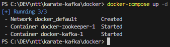
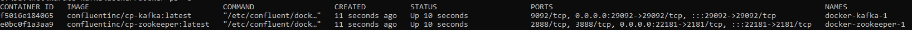
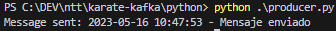
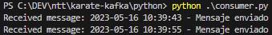

<h1 align="center">Karate & Kafka</h1>

<p align="center">
  
  
<p>

<p align="center">
  <a href="#descripción">Descripción</a> •
  <a href="#estructura">Estructura</a> •
  <a href="#entorno">Entorno</a> •
  <a href="#comandos">Comandos</a> •
  <a href="#ejemplo">Ejemplo de uso</a>
  
</p>

<hr>

<br>

# Descripción
Automatización que produce y consume un mensaje de un servidor Kafka

# Estructura
La estructura de carpeta es similar a la de cualquier otro dominio dentro de este proyecto. Estas serían las rutas:

* ```./python```: Scripts de Python para producir y consumir mensajes de Kafka. No se usan en la automatización
* ```./docker```: Carpeta donde se ubica el fichero ```docker-composer.yml``` necesario para levantar el entorno de prueba
* ```./src/test/resources/test-cases```: Ruta donde se deben dejar los ficheros ```.feature``` con los tests para ser ejecutados
* ```./target/karate-reports```: Ruta donde se guardará el reporte que haya generado Karate para la última ejecución
* ```.src/test/java/com/kafkatest```: Ruta donde se encuentran las clases Java para el Producer y Consumer utilizado en la automatización

# Entorno
El entorno usado estará basado en Docker para facilitar la ejecución local en cualquier máquina.

Será necesario tener instalado <a href="https://docker.io">Docker</a> o <a href="https://rancherdesktop.io/">Rancher</a> para poder levantar el entorno de prueba.
Todo el entorno se se levanta con el siguiente comando ejecutado dentro de la carpeta ```./docker``` que es donde se encuentra el fichero ```docker-compose.yml```:
```
docker-compose up -d
```

Esto descargará las imágenes y creará los contenedores que contienen el servidor kafka y zookeeper


Si ejecutamos el comando ```docker ps -a``` se verá que los contenedores están creados y activos, también se verán los puertos expuestos que en este caso es el ```29092```



# Comandos
> **Info**
> Los comandos MVN se tiene que ejecutar desde la carpeta donde se encuentre el fichero pom.xml
> Los scripts de Python se tiene que ejecutar desde la carpeta donde se encuentren.
> Ver <a href="#estructura">Estructura</a>

## Ejecutar automatización


Este sería el comando MVN para lanzar la automatización de forma manual:
```mvn clean test "-Dkarate.options=--tags @kafka" -Dtest=KarateRunnerTest```

Parámetros:
* ```-Dkarate.options=--tags @kafka```: Opcional. Especifíca que tags se deben ejecutar. Si se pone el símbolo ```~``` por delante del tag omitirá los tests que la contengan.


## Producer de Kafka usando Python


Script que al ejecutarse produce un mensaje contra el topic de Kafka.
Dentro del script se puede configurar el servidor de Kafka y topic al que debe enviar el mensaje

Comando para ejecutar el script: ```python .\producer.py```




**Configuración del script:**
* ```kafka_topic```: Topico al que se subscribirá para enviar mensajes 
* ```kafka_bootstrap_server```: Servidor(es) de Kafka
* ```kafka_key```: Key para los mensajes
* ```kafka_value```: Mensaje que se enviará

También hay una variante del script que utiliza un esquema Avro para generar un mensaje. El esquema se encuentra en el fichero ```./python/esquema.avsc```

## Consumer de Kafka usando Python


Script que al ejecutarse se queda leyendo de forma continuada el topic de Kafka y muestra los mensajes nuevos que van llegando.
Dentro del script se puede configurar el servidor de Kafka y topic al que debe suscribirse

Comando para ejecutar el script: ```python .\consumer.py```

Los mensajes que vayan llegando al topic se irán mostrando en la consola:



**Configuración del script:**
* ```kafka_topic```: Topic al que se subscribirá para leer mensajes 
* ```kafka_bootstrap_server```: Servidor(es) de Kafka
* ```kafka_auto_offset_reset```: Punto desde el cual empezará a leer mensajes
* ```kafka_enable_auto_commit```: Marcar automaticamente el mensaje como leido (dentro del group-id)
* ```kafka_group_id```: Grupo al que pertenecerá

También hay una variante del script que utiliza un esquema Avro para consumir un mensaje. El esquema se encuentra en el fichero ```./python/esquema.avsc```


# Ejemplo de uso


Un ejemplo de como utilizar la automatización es la de tener el consumer de Python arrancado y posteriormente lanzar la automatización para producir y leer los mensajes que se envíen

1. Levantar entorno Docker
2. Arrancar consumer Python 
3. Desde otra consola, arrancar la automatización
    3.1 En la consola donde se encuentre el consumer de Python tendrán que ir apareciendo los mensajes de la automatización
    3.2 La automatización se ejecutará enviando y comprobando que los mensajes han llegado correctamente
4. En el reporte se podrá comprobar el resultado de la prueba


# Dependencias
* pip install avro
